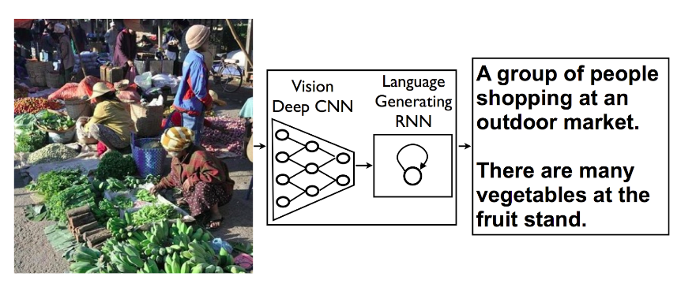

# deep-learning-image-captioning
Define and train an image-to-caption model, that can produce descriptions for real world images! 
- Week 6 of Deep Learning Course from Coursera! (https://www.coursera.org/learn/intro-to-deep-learning/home/welcome)

## Data

- Train images http://msvocds.blob.core.windows.net/coco2014/train2014.zip
- Validation images http://msvocds.blob.core.windows.net/coco2014/val2014.zip
- Captions for both train and validation http://msvocds.blob.core.windows.net/annotations-1-0-3/captions_train-val2014.zip

## Model Architeture

- Model architecture: CNN encoder and RNN decoder. 
(https://research.googleblog.com/2014/11/a-picture-is-worth-thousand-coherent.html)

- We will use pre-trained InceptionV3 model for CNN encoder (https://research.googleblog.com/2016/03/train-your-own-image-classifier-with.html) and extract its last hidden layer as an embedding:

- Since our problem is to generate image captions, RNN text generator should be conditioned on image. The idea is to use image features as an initial state for RNN instead of zeros.

- We will transform image feature vector to RNN hidden state size by fully-connected layer and then pass it to RNN.

- During training we will feed ground truth tokens into the lstm to get predictions of next tokens.

- Applying model

    -- Here we construct a graph for our final model.

    It will work as follows:
    - take an image as an input and embed it
    - condition lstm on that embedding
    - predict the next token given a START input token
    - use predicted token as an input at next time step
    - iterate until you predict an END token

